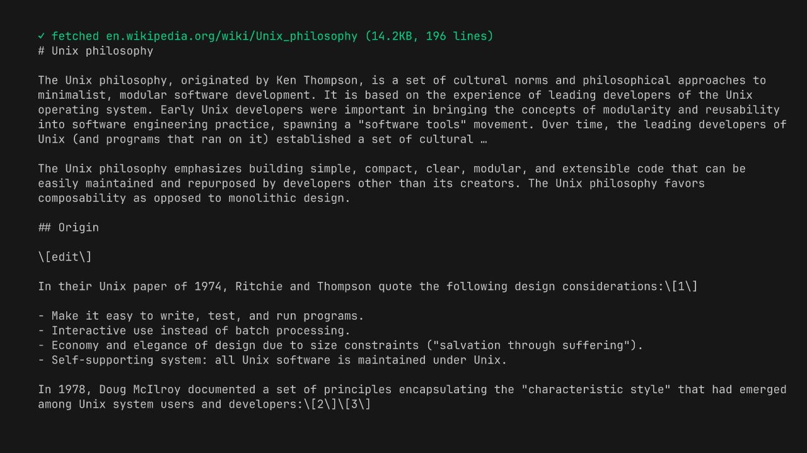

# @bitcraft-apps/pi-web-tools

Shell-only web search and fetch tools for [pi.dev](https://pi.dev). **Zero API keys, zero accounts** — just `ddgr` + `pandoc`/`w3m` running locally.

## Tools

### `websearch`


DuckDuckGo search via [`ddgr`](https://github.com/jarun/ddgr). Returns up to 25 results with title, URL, snippet.

### `webfetch`



`fetch` + optional content-extraction pre-pass + HTML→markdown via `pandoc` (preferred) or `w3m` (fallback). Auto-handles Cloudflare challenges via UA hack. Blocks SSRF (localhost/RFC1918). Optional add-ons: a Reader-View extractor for chrome-heavy pages ([docs/extraction.md](docs/extraction.md)) and `pdftotext` for PDFs ([docs/pdf.md](docs/pdf.md)).

## Install

```bash
# 1. System deps (one-time)
brew install ddgr pandoc        # macOS
# or: pip install ddgr; apt install pandoc w3m

# Optional add-ons (recommended):
#   pipx install trafilatura     # Reader-View extraction — see docs/extraction.md
#   brew install poppler         # PDF support — see docs/pdf.md

# 2. Extension (from npm)
pi install npm:@bitcraft-apps/pi-web-tools

# Or pin a specific version:
# pi install npm:@bitcraft-apps/pi-web-tools@<version>

# Or for local dev / hacking on the source:
pi install -e /path/to/pi-web-tools
```

After install, restart pi and the `websearch` and `webfetch` tools become available.

## Usage examples

In a pi session:

```
> Find me docs for Bun's native Sqlite API
[agent uses websearch → gets bun.sh URL → uses webfetch → reads docs]
```

You don't call them directly — pi's agent calls them when it needs.

## Limits and behavior

- `websearch`: default 8 results, hard cap 25. DuckDuckGo rate-limits ~10 req/min/IP. If you hit it, wait or use `webfetch` directly.
  - `region` (optional): DuckDuckGo region code, e.g. `pl-pl`, `us-en`, `de-de`. Maps to ddgr's `--reg`. Default: ddgr's built-in (`us-en`).
  - `safesearch` (optional): `off` | `moderate` | `strict`. Default `moderate`. `off` passes `--unsafe` to ddgr. ddgr does not distinguish moderate vs strict — both use its default safe-search behavior (see [ddgr.1 manpage](https://github.com/jarun/ddgr/blob/master/ddgr.1); only `--unsafe` is exposed).
  - `time` (optional): `d` | `w` | `m` | `y` — restrict results to the past day/week/month/year. Maps to ddgr's `--time`. Default: no filter (all time). Use when the query is time-sensitive ("latest", "recent", "this week") — DuckDuckGo's default ranking otherwise surfaces years-old SEO content above recent results.
- `webfetch`: default 50k chars output, hard cap 200k; 5 MB response cap; 30s timeout.
- `webfetch` sends `Accept: text/markdown,text/html;q=0.9,…` first; sites that honor it (Cloudflare's "Markdown for Agents", GitHub docs, Anthropic docs, Stripe API docs, …) return pre-rendered markdown — typically 10–100× smaller.
- `webfetch` cannot fetch: images, video, audio, localhost, 127/8, 169.254/16; PDFs unless optional `pdftotext` is installed.
- `webfetch` cannot render JS-only SPAs (you'll get empty markdown).
- `webfetch` pagination: pass `offset` (default 0) to read past the 200k-char per-call cap; thread the `Y` from the `[TRUNCATED — returned chars [X, Y) of Z total. Re-call with offset=Y …]` footer back as the next `offset`. The range is half-open (`X` inclusive, `Y` exclusive) so passing `Y` resumes exactly where the previous chunk stopped, with no overlap or gap. **Stop paginating once the section the agent needs is in hand.**
- On `429`/`503`, honors `Retry-After` (delta-seconds or HTTP-date) for **one** retry, capped at 10s. No backoff, no retry on other statuses.
- Cross-host redirects are surfaced in-band via a `[REDIRECTED — input was https://INPUT_HOST, final URL is FINAL_URL]` line prepended to the markdown; userinfo (`user:pass@`) is stripped. Same-host redirects produce no notice.
- Honors the `charset=` parameter on `Content-Type` for response decoding (e.g. `windows-1250`, `iso-8859-2`, `shift_jis`, `gb2312`). Unknown labels fall back to UTF-8.
- For HTML responses without a `Content-Type` charset, sniffs `<meta charset="...">` or `<meta http-equiv="Content-Type" content="...; charset=...">` declared in the first 1024 bytes (HTML comments are stripped first).
- All operations are read-only and synchronous. No persistent state, no cache.

### What `webfetch` does *not* do

- **No JavaScript execution.** Pages that render client-side return empty markdown. Workarounds: try the same content via `old.reddit.com`, `*.json` API endpoints, RSS/Atom feeds, or the site's documented REST API.
- **No per-host routing.** `webfetch` does not switch behavior based on hostname (no `if hostname === "github.com"` branches). If you want "use `gh` for GitHub URLs, fall back to `webfetch` otherwise," that belongs in a personal pi skill in `~/.pi/agent/skills/`, not in this package. See [`AGENTS.md`](./AGENTS.md) “Bar for new tools” for the full rationale.
- **No headless browser.** Out of scope per `AGENTS.md`. Shell-only is the project's design constraint.

## Troubleshooting

- `ddgr not installed` → `brew install ddgr` or `pip install ddgr`
- `Need pandoc or w3m installed` → `brew install pandoc`
- `DuckDuckGo timed out (likely rate-limited)` → wait 1–2 min
- `Site requires JS, cannot fetch in shell-only mode` → site uses Cloudflare/JS-only; not solvable without headless browser, out of scope for this tool

## Development

```bash
# one-time, if you don't have bun:
#   macOS:        brew install bun
#   Linux / WSL:  curl -fsSL https://bun.sh/install | bash
# (or see https://bun.sh for other options)
git clone https://github.com/bitcraft-apps/pi-web-tools
cd pi-web-tools
bun install
bun run typecheck           # type-check via tsgo (@typescript/native-preview); CI runs this before tests
bun run lint                # oxlint + type-aware oxlint-tsgolint; CI runs this before tests
bun run format              # apply oxfmt to src/, test/, index.ts, vitest.config.ts
bun run format:check        # CI runs this before lint; fails if anything is unformatted
bun run test                # unit tests, no network
bun run test:network        # integration tests (requires net)
```

We use **bun** as the dev package manager. The committed lockfile is `bun.lock`; `package-lock.json` is gitignored.

> End-user installs (`pi install npm:...`) pull a published tarball from the npm registry. The tarball ships only `index.ts`, `src/`, `README.md`, `LICENSE`, and `CHANGELOG.md` (no tests, no `bun.lock`, no CI configs) — see `files` in `package.json`. `bun.lock` is the dev lockfile only; transitive deps for end users are resolved by `npm install` against the registry at install time. Peer deps are wildcard-pinned, no runtime deps drift in breaking ways.

Hot-reload during dev:

```bash
ln -s "$(pwd)" ~/.pi/agent/extensions/pi-web-tools
# in pi session: /reload
```

## License

MIT
