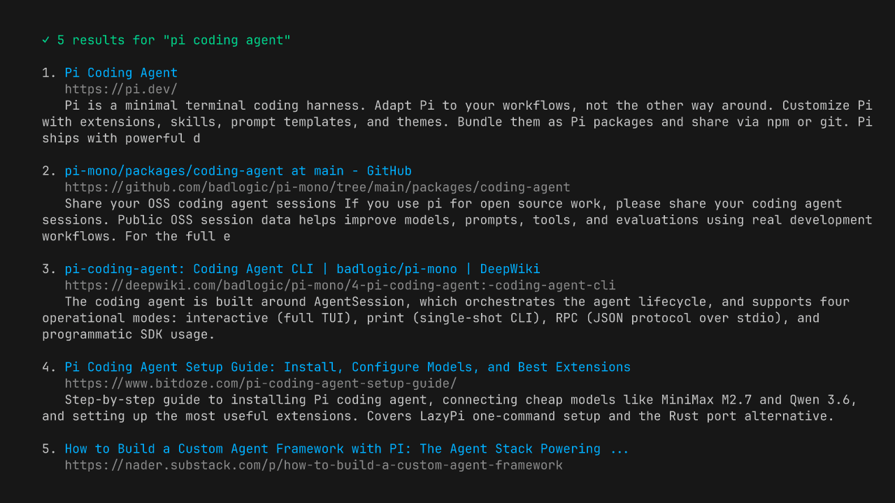

# @bitcraft-apps/pi-web-tools



Shell-only web search and fetch tools for [pi.dev](https://pi.dev). **Zero API keys, zero accounts** — just `ddgr` + `pandoc`/`w3m` running locally.

## Tools

- **`websearch`** — DuckDuckGo search via [`ddgr`](https://github.com/jarun/ddgr). Returns up to 25 results with title, URL, snippet.
- **`webfetch`** — `fetch` + optional content-extraction pre-pass + HTML→markdown via `pandoc` (preferred) or `w3m` (fallback). Auto-handles Cloudflare challenges via UA hack. Blocks SSRF (localhost/RFC1918). See [Content extraction](#content-extraction-optional).

## Install

```bash
# 1. System deps (one-time)
brew install ddgr pandoc        # macOS
# or: pip install ddgr; apt install pandoc w3m

# 2. Extension (from npm)
pi install npm:@bitcraft-apps/pi-web-tools

# Or pin a specific version:
# pi install npm:@bitcraft-apps/pi-web-tools@0.2.0

# Or for local dev / hacking on the source:
pi install -e /path/to/pi-web-tools
```

After install, restart pi and the `websearch` and `webfetch` tools become available.

## Usage examples

In a pi session:

```
> Find me docs for Bun's native Sqlite API
[agent uses websearch → gets bun.sh URL → uses webfetch → reads docs]
```

You don't call them directly — pi's agent calls them when it needs.

## Limits and behavior

- `websearch`: default 8 results, hard cap 25. DuckDuckGo rate-limits ~10 req/min/IP. If you hit it, wait or use `webfetch` directly.
  - `region` (optional): DuckDuckGo region code, e.g. `pl-pl`, `us-en`, `de-de`. Maps to ddgr's `--reg`. Default: ddgr's built-in (`us-en`).
  - `safesearch` (optional): `off` | `moderate` | `strict`. Default `moderate`. `off` passes `--unsafe` to ddgr. ddgr does not distinguish moderate vs strict — both use its default safe-search behavior (see [ddgr.1 manpage](https://github.com/jarun/ddgr/blob/master/ddgr.1); only `--unsafe` is exposed).
- `webfetch`: default 50k chars output, hard cap 200k. 5 MB response cap. 30s timeout. **Cannot fetch:** PDFs, images, video, audio, localhost, 127/8, 169.254/16. **Cannot render:** JS-heavy SPAs (you'll get an empty markdown).
- Honors the `charset=` parameter on `Content-Type` for response decoding (e.g. `windows-1250`, `iso-8859-2`, `shift_jis`, `gb2312`). Unknown labels fall back to UTF-8.
- For HTML responses without a `Content-Type` charset, sniffs `<meta charset="...">` or `<meta http-equiv="Content-Type" content="...; charset=...">` declared in the first 1024 bytes (HTML comments are stripped first).
- All operations are read-only and synchronous. No persistent state, no cache.

### Content extraction (optional)

For chrome-heavy pages (GitHub repos, MDN, news articles, Stack Overflow, blog posts) the bulk of the converted markdown is navigation, sidebars, footers, cookie banners, and inline icon SVGs — not the content the agent asked for. If a Reader-View-style extractor is on `$PATH`, `webfetch` runs it between the HTTP fetch and the markdown conversion. Result: typically 5–20× smaller output on those pages, with the actual article preserved.

**Install one (recommended):**

```bash
pipx install trafilatura     # works everywhere with Python; recommended primary install
# rdrview alternative — https://github.com/eafer/rdrview
#   Linux: package manager, or build from source.
#   macOS: build from source (no homebrew formula upstream).
```

Detection order: `trafilatura` first, then `rdrview`. Detected once per process and cached. The extractor emits cleaned HTML; the existing `pandoc`/`w3m` step then converts it to markdown so the output style is identical regardless of which extractor (or none) ran.

No extractor present? `webfetch` keeps working — you just get the full pre-extraction markdown as before. A one-shot warning is written to stderr on the first call so you know what you're missing; it is **never** added to tool output.

**Caveats:**

- **Relative links.** `rdrview` resolves relative `href`s to absolute using the page URL. `trafilatura` (when used via stdin) does not; relative links stay relative in its output. Most agents handle this from context; mention it in your prompt if it matters.
- **Fallback when extraction looks wrong.** If the extracted HTML is < 1% of the original and the original was > 10 KB (e.g. Readability picked the wrong container on a chrome-only page), `webfetch` discards the extracted result and converts the full HTML instead. You'll get a larger but complete result.
- **Pages where the wanted content is outside the article container** (e.g. a code listing in a sidebar) may have it stripped by extraction. There's currently no per-call opt-out; if it bites you in practice, open an issue with the URL.
- **$PATH trust.** The agent process inherits the user's `$PATH`; bare `trafilatura`/`rdrview` (same posture as `pandoc`/`ddgr`) means a poisoned earlier `$PATH` entry runs as the extractor. Newly relevant here because extractors parse attacker-controlled HTML.

### What `webfetch` does *not* do

- **No JavaScript execution.** Pages that render client-side return empty markdown. Workarounds: try the same content via `old.reddit.com`, `*.json` API endpoints, RSS/Atom feeds, or the site's documented REST API.
- **No per-host routing.** `webfetch` does not switch behavior based on hostname (no `if hostname === "github.com"` branches). If you want "use `gh` for GitHub URLs, fall back to `webfetch` otherwise," that belongs in a personal pi skill in `~/.pi/agent/skills/`, not in this package. See [`AGENTS.md`](./AGENTS.md) “Bar for new tools” for the full rationale.
- **No headless browser.** Out of scope per `AGENTS.md`. Shell-only is the project's design constraint.

## Troubleshooting

- `ddgr not installed` → `brew install ddgr` or `pip install ddgr`
- `Need pandoc or w3m installed` → `brew install pandoc`
- `DuckDuckGo timed out (likely rate-limited)` → wait 1–2 min
- `Site requires JS, cannot fetch in shell-only mode` → site uses Cloudflare/JS-only; not solvable without headless browser, out of scope for this tool

## Development

```bash
# one-time, if you don't have bun:
#   macOS:        brew install bun
#   Linux / WSL:  curl -fsSL https://bun.sh/install | bash
# (or see https://bun.sh for other options)
git clone https://github.com/bitcraft-apps/pi-web-tools
cd pi-web-tools
bun install
bun run typecheck           # type-check via tsgo (@typescript/native-preview); CI runs this before tests
bun run lint                # oxlint + type-aware oxlint-tsgolint; CI runs this before tests
bun run format              # apply oxfmt to src/, test/, index.ts, vitest.config.ts
bun run format:check        # CI runs this before lint; fails if anything is unformatted
bun run test                # unit tests, no network
bun run test:network        # integration tests (requires net)
```

We use **bun** as the dev package manager. The committed lockfile is `bun.lock`; `package-lock.json` is gitignored.

> End-user installs (`pi install npm:...`) pull a published tarball from the npm registry. The tarball ships only `index.ts`, `src/`, `README.md`, `LICENSE`, and `CHANGELOG.md` (no tests, no `bun.lock`, no CI configs) — see `files` in `package.json`. `bun.lock` is the dev lockfile only; transitive deps for end users are resolved by `npm install` against the registry at install time. Peer deps are wildcard-pinned, no runtime deps drift in breaking ways.

> Note on npm scope: the GitHub org is `bitcraft-apps` because `bitcraft` was taken on GitHub. The npm scope `@bitcraft` is also taken, so the npm package is published as `@bitcraft-apps/pi-web-tools` to mirror the GH org (#5).

Hot-reload during dev:

```bash
ln -s "$(pwd)" ~/.pi/agent/extensions/pi-web-tools
# in pi session: /reload
```

## License

MIT
